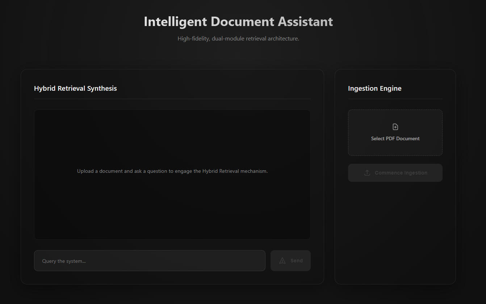

# Intelligent Document Assistant (Hybrid RAG Ecosystem)

<div align="center">
  
</div>

An advanced Retrieval-Augmented Generation (RAG) web application designed to ingest PDF documents, intelligently index both textual and visual elements (tables/images), and provide highly accurate answers using a hybrid retrieval mechanism (Dense Vectors + Sparse Keyword Matching).

## Features

- ✨ **Premium Aesthetic UI**: Built with Next.js, featuring a clean, responsive two-column layout with ambient glowing backgrounds and a live telemetry sidebar.
- ⚙️ **Real-time Ingestion Telemetry**: Watch the document ingestion process step-by-step (Partitioning, Chunking, Summarizing, Indexing) via Server-Sent Events (SSE).
- 🧠 **AI-Enhanced Chunking**: Automatically processes mixed media. Tables and images extracted from PDFs are passed through vision models to create highly searchable abstractive text summaries alongside the raw text.
- 🔍 **Hybrid Retrieval**: Combines state-of-the-art dense semantic search (Chroma + OpenAI Embeddings) and sparse lexical matching (BM25Okapi) using LangChain's EnsembleRetriever (70/30 weighting ratio).
- 💬 **Context-Aware Synthesis**: Synthesizes pinpoint accurate responses from retrieved chunks using `GPT-4o`, returning both the answer and the sources it used.

## Tech Stack

**Backend**
- Python 3.10+
- [FastAPI](https://fastapi.tiangolo.com/) for the REST API and Streaming Endpoints.
- [LangChain](https://www.langchain.com/) for LLM orchestration and retrieval layers.
- [Chroma](https://www.trychroma.com/) for Dense Vector Storage.
- [BM25](https://pypi.org/project/rank-bm25/) for Sparse Lexical Search.
- [Unstructured](https://unstructured.io/) for advanced PDF partitioning (text, tables, and image extraction).
- OpenAI embeddings (`text-embedding-3-small`) and LLMs (`gpt-4o`).

**Frontend**
- Next.js 14+ (App Router)
- React 19
- Vanilla CSS Modules for tailored, sleek UI design.

## Prerequisites

- [Node.js](https://nodejs.org/) (v18+)
- [Python](https://www.python.org/) 3.10+
- OpenAI API Key

## Getting Started

### 1. Backend Setup

Navigate to the project root and use `uv` to intelligently manage the environment and dependencies. This will automatically sync dependencies from the lockfile:

```bash
uv sync
```

Create a `.env` file in the root directory and add your OpenAI API key:

```env
OPENAI_API_KEY=your_openai_api_key_here
```

Start the FastAPI backend server:

```bash
uv run uvicorn api:app --reload
# The server will run on http://0.0.0.0:8000
```

### 2. Frontend Setup

Open a new terminal and navigate to the `frontend` directory:

```bash
cd frontend

# Install the necessary Node packages
npm install

# Run the Next.js development server
npm run dev
```

The frontend will be accessible at [http://localhost:3000](http://localhost:3000).

## Usage

1. Open the application in your browser.
2. In the right column (`Ingestion Engine`), click **Select PDF Document** to upload your file.
3. Click **Commence Ingestion** and observe the live telemetry progress bar as it partitions, chunks, summarizes, and indexes your document.
4. Once completed, use the left column (`Hybrid Retrieval Synthesis`) to query information from your newly ingested document. The AI will respond, citing its sources automatically!

## System Architecture Details

The system pipeline is handled across three main modules:
- `api.py`: Manages the FastAPI server routing, the REST APIs, and streams SSE progress.
- `RAG_Ingestion.py`: Runs a generator that utilizes unstructured parsers for splitting elements. Mixed elements (tables and images) are fed into `GPT-4o` to create AI-enhanced descriptive summaries prior to being saved into Chroma DB and BM25.
- `retrieval.py`: Orchestrates an `EnsembleRetriever` to intelligently rank chunks by matching sparse term frequency while retrieving broad context with semantically dense vectors.

## License

This project is open-source and available under the [MIT License](LICENSE).
